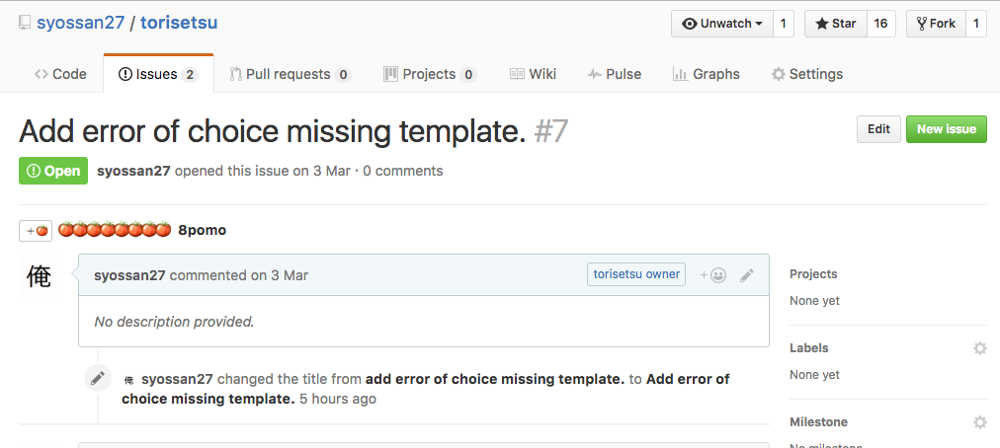
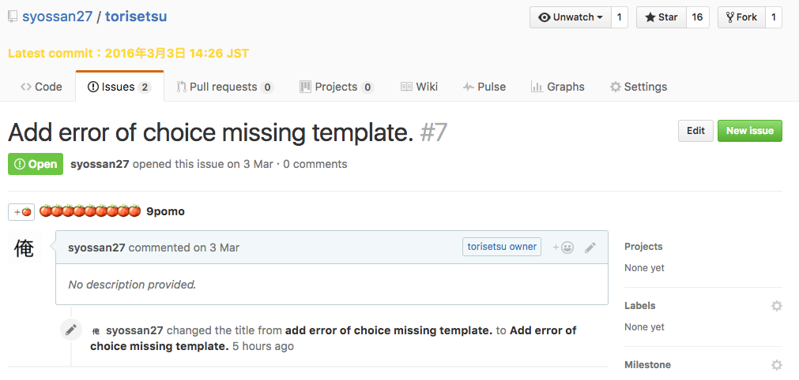

# gitpomo

Manage pomodoro for github issue.

## Description

- Click +🍅.

- Increment 🍅.

## Install

Install Here！
[Chrome WebStore - gitpomo](https://chrome.google.com/webstore/detail/gitpomo/leipccepjfacodjfedlhnnhjgondmoip?hl=ja)

## License

[MIT](http://opensource.org/licenses/mit-license.php)

## Author

[syossan27](https://github.com/syossan27)
